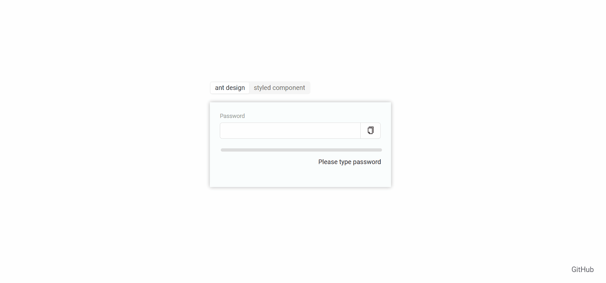

Password Meter
first option uses ant design library and regex algorithm, second styled-components and frequency counter with regex algorythm;

deployed with github pages [DEMO LINK](https://pavel-gutsal.github.io/password-meter/)

here is gif desktop demo:

